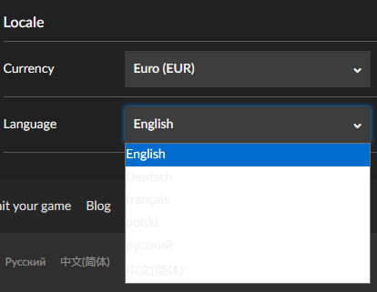

# GOG Dark Mode Enhancement Suite
A comprehensive userscript that enhances the dark mode experience on GOG.com and fixes visual bugs.

### Dark Mode Enhancements
- Library Page: Fixes bright separator lines between games that were visible in dark mode, now shows proper dark separators that work at all zoom levels  
- Settings Pages: Fixes dropdown menus, input fields, checkboxes, and radio buttons to have proper dark backgrounds and visible text  
- Wallet Page: Adjusts transaction header background color to match the dark theme  
- Download Popups: Changes the dropdown arrow from black to white to match the overall theme

### Light Mode Fixes
- Library Page: Ensures separator lines display consistently between games at all zoom levels (fixes the same zoom rendering issue that also existed in dark mode)  
- Orders Page: Removes unnecessary borders and spinners while searching

### Quality of Life Improvements
- Wishlist: Upgrades game cover images from 100px to 196px resolution (392px for retina displays)

### General Bug Fixes (Work in Both Modes)
- Orders Page: Fixes URL hash duplication bug where search terms would accumulate !%2F prefixes on each reload  
- Orders Page: Properly aligns "Orders history" text and search field at the same height

## Installation
1) Install a Userscript manager, such as Tampermonkey or Violentmonkey:
    * Chrome: [Tampermonkey](https://chrome.google.com/webstore/detail/tampermonkey/dhdgffkkebhmkfjojejmpbldmpobfkfo) | [Violentmonkey](https://chrome.google.com/webstore/detail/violentmonkey/jinjaccalgkegednnccohejagnlnfdag)
    * Firefox: [Greasemonkey](https://addons.mozilla.org/en-US/firefox/addon/greasemonkey/) | [Tampermonkey](https://addons.mozilla.org/en-US/firefox/addon/tampermonkey/) | [Violentmonkey](https://addons.mozilla.org/en-US/firefox/addon/violentmonkey/)
2) Open this link to install the userscript: https://raw.githubusercontent.com/chreddy/gog-dark-mode-enhancement-suite/master/gog-dark-mode-enhancement-suite.user.js

## Screenshots
### Library

   
   

  <i>Before and after images of the library</i>

### Dropdowns

   
   

  <i>Before and after images of dropdowns</i>

