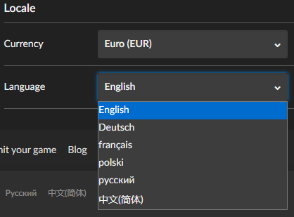

# GOG Dark Mode Enhancement Suite
A comprehensive userscript that enhances the dark mode experience on GOG.com and fixes visual bugs.

## Features
- **Visual Improvements**: Enhances colors, backgrounds, and UI consistency in dark mode
- **Bug Fixes**: Resolves various issues including broken links and search functionality
- **Quality of Life**: Better image quality, improved navigation, and additional useful links

See [CHANGELOG.md](CHANGELOG.md) for a list of all changes.

## Installation
1) Install a Userscript manager, such as Tampermonkey or Violentmonkey:
    * Chrome (and Chromium-based browsers): [Tampermonkey](https://chrome.google.com/webstore/detail/tampermonkey/dhdgffkkebhmkfjojejmpbldmpobfkfo) | [Violentmonkey](https://chrome.google.com/webstore/detail/violentmonkey/jinjaccalgkegednnccohejagnlnfdag)
    * Firefox: [Greasemonkey](https://addons.mozilla.org/en-US/firefox/addon/greasemonkey/) | [Tampermonkey](https://addons.mozilla.org/en-US/firefox/addon/tampermonkey/) | [Violentmonkey](https://addons.mozilla.org/en-US/firefox/addon/violentmonkey/)
2) Open this link to install the userscript: https://raw.githubusercontent.com/chreddy/gog-dark-mode-enhancement-suite/master/gog-dark-mode-enhancement-suite.user.js

## Screenshots
### Library

   
   

  <i>Before and after images of the library</i>

### Dropdowns

   
   

  <i>Before and after images of dropdowns</i>

